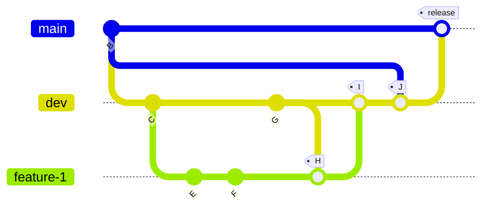

# Table of Contents

1. [Welcome to **Woofmeets Frontend Setup**](#intro)
2. [Tools Required](#tools)
3. [Getting Started](#started)
4. [Committing Code](#commit)
5. [Jira Workflow](#jira)
6. [FAQ](#faq)

## Welcome to **Woofmeets Frontend Setup** <a name="intro"></a> 

[](https://conventionalcommits.org) [](https://github.com/GIScience/badges#active)

| :shamrock: **Conventions** |
| --- |
| Please discuss page type with your team leads, ether SSR, ISR, Static, or CSR for page performance |
| Please use images with less than *100kb* |

---

| :warning: **IMPORTANT** |
| ---- |
| [Credentials Repository](https://algosolver-llc.atlassian.net/wiki/spaces/WBD/pages/319455497/Platform+Credentials)     |
| [Confluence Page](https://algosolver-llc.atlassian.net/wiki/spaces/WBD/pages/319193150/Development+Roadmap)|
| [Woofmeets JIRA Board](https://algosolver-llc.atlassian.net/jira/software/c/projects/WOOF/boards/45)|

---

## Tools Required <a name="tools"></a>

| :warning: Important |
| --- |
| You will find important files here |

1. [x] [.env](https://drive.google.com/drive/folders/1ltKIn3DCjQNKhgZ8yXKvWV6DSJKMKXVR?usp=sharing) Env file can be found  over here
2. [x] [Confluence](https://algosolver-llc.atlassian.net/wiki/spaces/WBD/pages/319455497/Platform+Credentials) has important account links
3. [x] [Roadmap](https://algosolver-llc.atlassian.net/wiki/spaces/WBD/pages/319193150/Development+Roadmap) has the project roadmap

### VSCODE AND Database Tooling

1. [x] Prettier
2. [x] [Markdown Preview Enhanced](https://marketplace.visualstudio.com/items?itemName=shd101wyy.markdown-preview-enhanced)
3. [x] [Markdown Preview Mermaid Support](https://marketplace.visualstudio.com/items?itemName=bierner.markdown-mermaid)

### Development

1. [x] Node Js **LTS**
    - [x] Yarn
2. [x] Configured `.env` file  

### Production (Additionally)

1. [x] pm2 - Node process manager

---

## Getting Started <a name="started"></a>

### Development Server

```bash
yarn
yarn dev
// http://localhost:3000/docs #(Access Swagger)
```

### Production Server

```bash
sudo yarn
sudo yarn build
sudo pm2 restart ecosystem.config.js
sudo systemctl restart nginx
```

---

## Committing Code <a name="commit"></a>



| ID | Feature |
| ---| ------- |
| H  | Pull in dev in your feature branch |
| I | Merged code after your MR is reviewed and accepted |
| J | Pull in master in dev and **resolve merge conflicts**
| release | Dev merged with main for production release |

| :exclamation: This is very important |
| ------------------------------------ |
| Please utilize conventional commits standard |

e.g. To commit code after adding your feature

```bash
git add feature
yarn run cm
```

---

## FAQ <a name="faq"></a>

### Before pusing to gitlab

After merging your code please ensure your build is succeeding

```bash
yarn
yarn build
```

---

## Jira Workflow <a name="jira"></a>

1. Before starting any ticket, please ensure that AC is complete and understandable
2. Any converstaions regarding a particular ticket should be documented in the form of comments
3. Discuss with your frontend and mobile team pair before working and **maintain effective communication**

---
> title: Senior Software Engineer
> author: Rubaith Adnan
> contact: rubaith@algosolver.com
